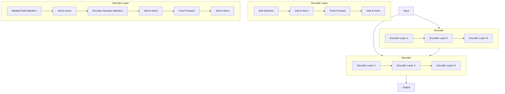

## ハイレベルアーキテクチャ

```mermaid
graph TD
    Input[Input] --> Encoder
    subgraph Encoder
        E1[Encoder Layer 1]
        E2[Encoder Layer 2]
        E3[Encoder Layer N]
        E1 --> E2
        E2 --> E3
    end
    Input --> Decoder
    Encoder --> Decoder
    subgraph Decoder
        D1[Decoder Layer 1]
        D2[Decoder Layer 2]
        D3[Decoder Layer N]
        D1 --> D2
        D2 --> D3
    end
    Decoder --> Output[Output]

    subgraph "Encoder Layer"
        EL1[Self-Attention]
        EL2[Add & Norm]
        EL3[Feed Forward]
        EL4[Add & Norm]
        EL1 --> EL2
        EL2 --> EL3
        EL3 --> EL4
    end

    subgraph "Decoder Layer"
        DL1[Masked Self-Attention]
        DL2[Add & Norm]
        DL3[Encoder-Decoder Attention]
        DL4[Add & Norm]
        DL5[Feed Forward]
        DL6[Add & Norm]
        DL1 --> DL2
        DL2 --> DL3
        DL3 --> DL4
        DL4 --> DL5
        DL5 --> DL6
    end
```

## 参考になりそうな資料

- 参考になりそうな資料: https://www.datacamp.com/tutorial/how-transformers-work